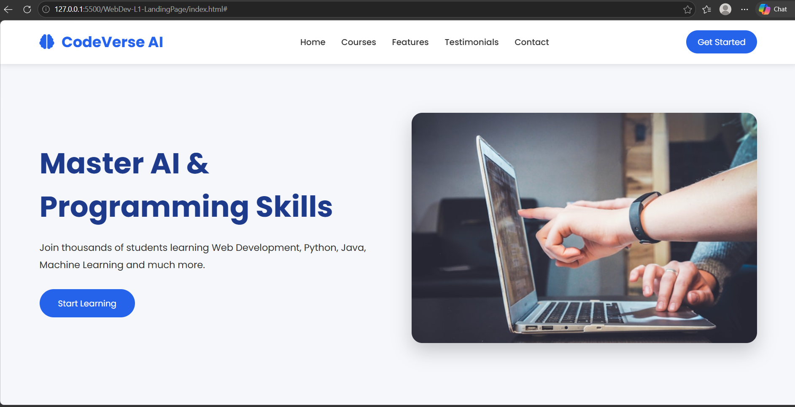
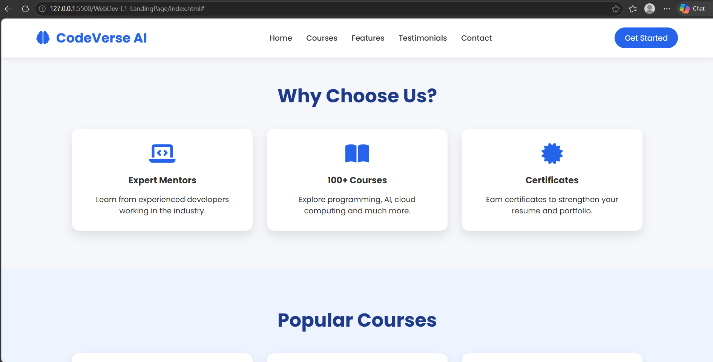
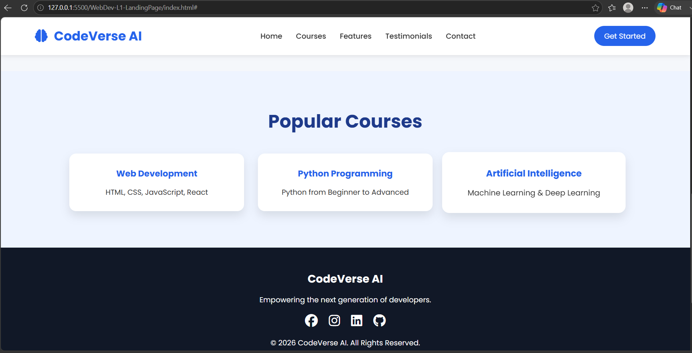
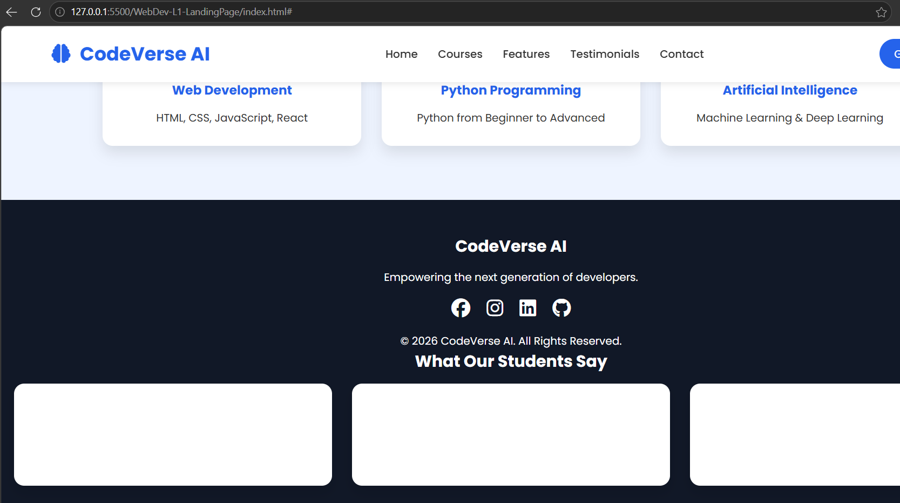

# CodeVerse AI - Landing Page

## Project Overview

This project is a modern and responsive landing page developed as part of the **Oasis Infobyte Web Development Internship (OIBSIP)**.

The landing page is designed for an AI learning platform called **CodeVerse AI**. It features a clean interface, responsive layout, and modern web design principles.

---

## Technologies Used

- HTML5
- CSS3
- JavaScript
- Google Fonts
- Font Awesome

---

## Features

- Responsive Navigation Bar
- Hero Section
- Features Section
- Popular Courses Section
- Testimonials Section
- Footer
- Responsive Design
- Smooth Scrolling
- Modern UI with Hover Effects

---

## Folder Structure

```
WebDev-L1-LandingPage/
│── index.html
│── style.css
│── script.js
│── README.md
└── images/
    ├── landing-page-1.png
    ├── landing-page-2.png
    ├── landing-page-3.png
    └── landing-page-4.png
```

---

## Screenshots

### Home Page



### Features Section



### Courses Section



### Footer



---

## Internship

This project was developed as **Task 1 - Landing Page** for the **Oasis Infobyte Web Development Internship (OIBSIP).**

---

## Author

**Nandu**

B.Tech - Computer Science and Engineering