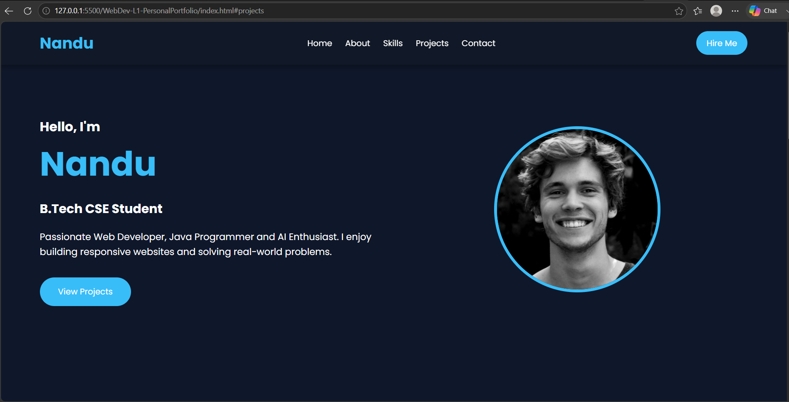
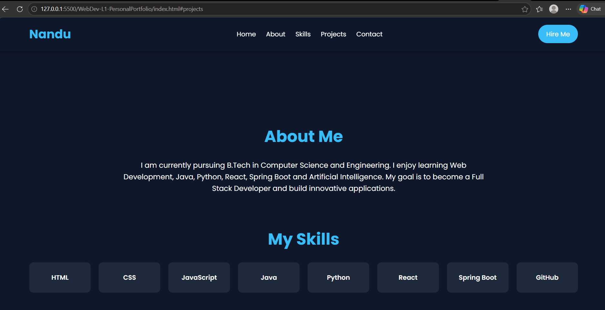
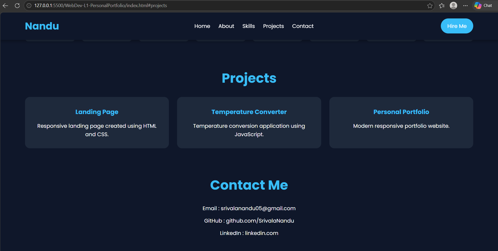
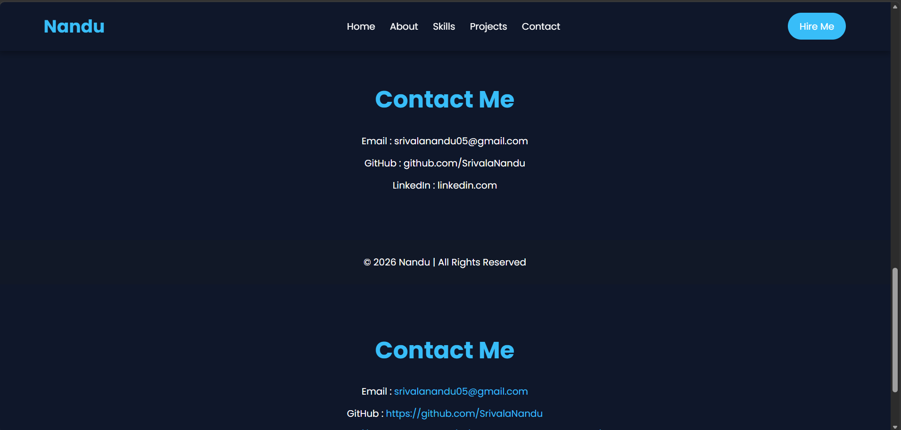
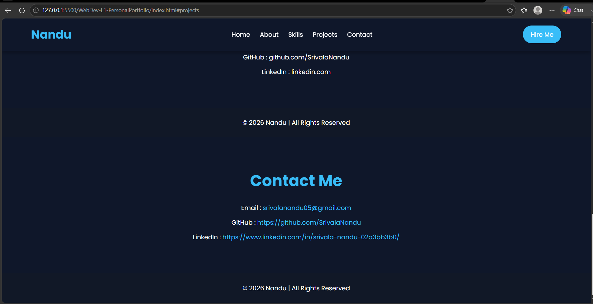

# Personal Portfolio Website

## 📌 Project Overview

This is a responsive personal portfolio website developed as part of the **Oasis Infobyte Web Development Internship (OIBSIP)**.

The portfolio showcases my profile, skills, projects, education, and contact information using a modern and responsive design.

---

## 🚀 Technologies Used

- HTML5
- CSS3
- JavaScript
- Google Fonts
- Font Awesome

---

## ✨ Features

- Responsive Navigation Bar
- Hero Section
- About Me Section
- Skills Section
- Projects Section
- Contact Section
- Footer
- Smooth Scrolling
- Mobile Responsive Design

---

## 📂 Folder Structure

```
WebDev-L1-PersonalPortfolio/
│── index.html
│── style.css
│── script.js
│── README.md
└── images/
```

---

## 📸 Screenshots

### Home Page



### About Section



### Skills Section



### Projects Section



### Contact Section



---

## 👨‍💻 About Me

**Name:** Nandu

**Course:** B.Tech - Computer Science and Engineering

**Skills:**
- HTML
- CSS
- JavaScript
- Java
- Python
- React
- Spring Boot
- Git & GitHub

---

## 📬 Contact

**LinkedIn:**  
https://www.linkedin.com/in/srivala-nandu-02a3bb3b0/

**GitHub:**  
https://github.com/SrivalaNandu

---

## 🎯 Internship

This project was developed as **Task 2 – Personal Portfolio** for the **Oasis Infobyte Web Development Internship (OIBSIP).**

---

## 📄 License

This project is created for educational and internship purposes.