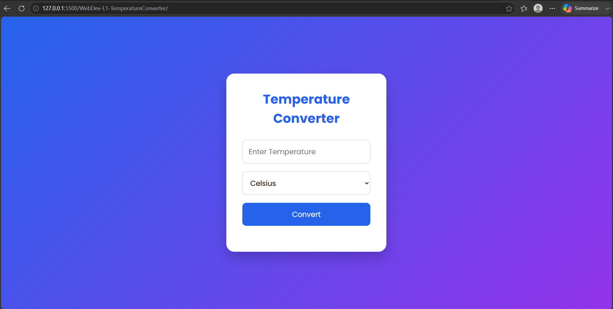
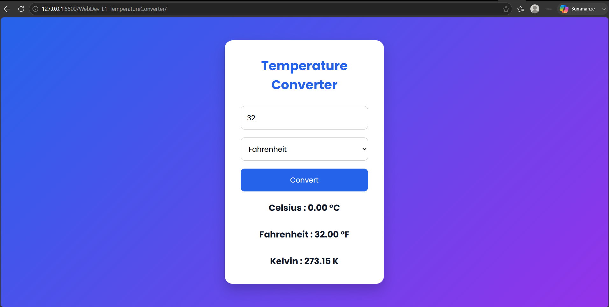
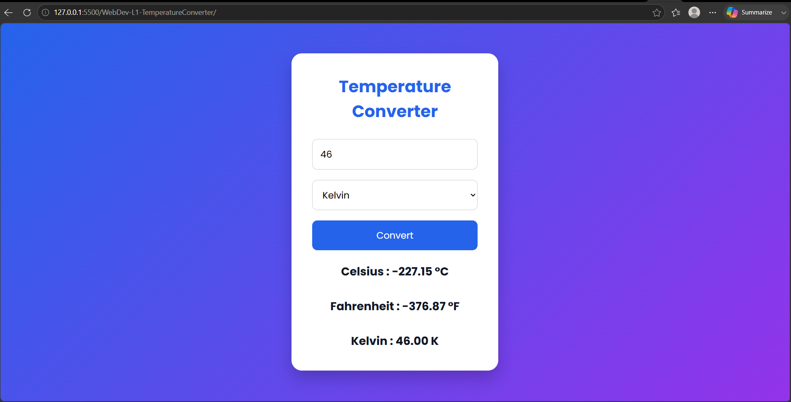

# Temperature Converter

##  Project Overview

This project is a responsive Temperature Converter developed as part of the **Oasis Infobyte Web Development Internship (OIBSIP)**.

The application allows users to convert temperatures between **Celsius**, **Fahrenheit**, and **Kelvin** with a simple and user-friendly interface.

---

##  Technologies Used

- HTML5
- CSS3
- JavaScript

---

##  Features

- Convert Celsius to Fahrenheit and Kelvin
- Convert Fahrenheit to Celsius and Kelvin
- Convert Kelvin to Celsius and Fahrenheit
- Absolute Zero Validation
- Responsive Design
- Modern User Interface

---

##  Folder Structure

```
WebDev-L1-TemperatureConverter/
│── index.html
│── style.css
│── script.js
│── README.md
└── images/
    ├── converter-1.png
    ├── converter-2.png
    ├── converter-3.png
```

---

##  Screenshots

### Home Page



### Conversion Example



### Result



---

## Internship

This project was developed as **Task 3 – Temperature Converter** for the **Oasis Infobyte Web Development Internship (OIBSIP).**

---

##  Author

**Nandu**

B.Tech – Computer Science and Engineering

GitHub: https://github.com/SrivalaNandu

LinkedIn: https://www.linkedin.com/in/srivala-nandu-02a3bb3b0/

---

## License

This project is created for educational and internship purposes only.